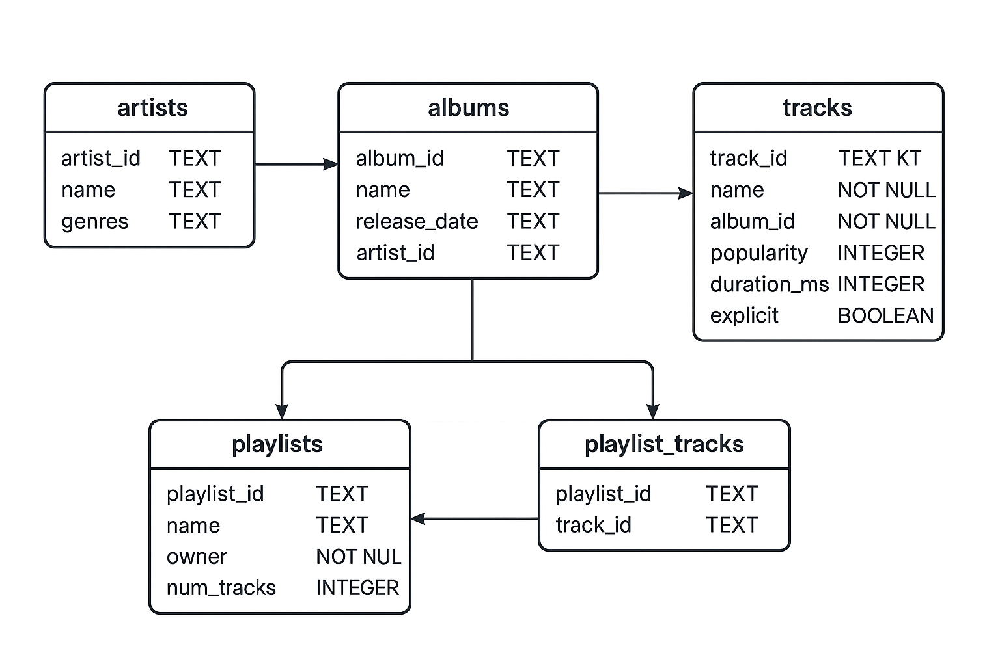

# 🎧 SQL Guidebook: Exploring My Spotify Data

## 🔹 Overview
This repo uses the Spotify Web API (via spotipy) to extract data about my playlists, tracks, albums, and artists. (`spotify_data_extract.py`)
The data is stored locally in an SQLite database (spotify.db), allowing me to explore patterns in my own music taste using SQL queries.

## 👩🏽‍💻 Database Setup 

### Design Principles
The schema was designed following relational database principles:
**Normalization:** Separate tables for artists, albums, tracks, playlists, and playlist_tracks to reduce redundancy.
**Primary Keys & Foreign Keys:** Ensure referential integrity. Example: album_id in tracks references albums(album_id).
**Many-to-Many Relationships:** playlist_tracks handles the many-to-many relationship between playlists and tracks.
**Data Types:** Text for names/IDs, integer for popularity and duration, boolean for explicit tracks.

### Data Collection
Data was fetched using Python & Spotify API:
1. spotipy library for authenticated API calls.
2. Fetched 30 playlists, their tracks, albums, and artist information.
3. Stored data in SQLite database (spotify.db).

### Populating the Tables
Data was inserted using a Python script with the Spotify API. Each record includes:
- Artist metadata (name, genre)
- Album info (release date)
- Track details (duration, popularity, explicit)
- Playlist metadata

### ⫘ Connection Setup
```bash
# Connection to SQLite DB
conn = sqlite3.connect("spotify.db")
cursor = conn.cursor()

# Creating tables (artists, albums, tracks, playlists, playlist_tracks)
cursor.execute("CREATE TABLE IF NOT EXISTS artists (...)")
cursor.execute("CREATE TABLE IF NOT EXISTS albums (...)")
# ... other tables ...

# Inserting data using INSERT OR IGNORE to avoid duplicates
cursor.execute("INSERT OR IGNORE INTO tracks (...) VALUES (?, ?, ?, ?, ?, ?)", ...)
```

---

## Entity Relationship Diagram


### Table Schema:

#### 1. `artists`
| Column      | Data Type | Constraints         | Description                       |
|------------|-----------|-------------------|-----------------------------------|
| artist_id  | TEXT      | PRIMARY KEY        | Unique Spotify artist identifier  |
| name       | TEXT      | NOT NULL           | Artist name                       |
| genres     | TEXT      | NULLABLE           | Comma-separated list of genres    |

---

#### 2. `albums`
| Column      | Data Type | Constraints              | Description                        |
|------------|-----------|-------------------------|------------------------------------|
| album_id   | TEXT      | PRIMARY KEY             | Unique Spotify album identifier   |
| name       | TEXT      | NOT NULL                | Album name                        |
| release_date | TEXT    | NOT NULL                | Album release date (YYYY-MM-DD)   |
| artist_id  | TEXT      | FOREIGN KEY REFERENCES `artists(artist_id)` | Artist of the album |

---

#### 3. `tracks`
| Column      | Data Type | Constraints              | Description                        |
|------------|-----------|-------------------------|------------------------------------|
| track_id   | TEXT      | PRIMARY KEY             | Unique Spotify track identifier   |
| name       | TEXT      | NULLABLE                | Track name                        |
| album_id   | TEXT      | FOREIGN KEY REFERENCES `albums(album_id)` | Album the track belongs to       |
| popularity | INTEGER   | NOT NULL                | Spotify popularity score (0–100) |
| duration_ms| INTEGER   | NOT NULL                | Duration in milliseconds          |
| explicit   | BOOLEAN   | NOT NULL                | Explicit content flag             |

---

#### 4. `playlists`
| Column       | Data Type | Constraints         | Description                     |
|------------|-----------|-------------------|---------------------------------|
| playlist_id | TEXT      | PRIMARY KEY        | Unique Spotify playlist ID      |
| name        | TEXT      | NOT NULL           | Playlist name                   |
| owner       | TEXT      | NOT NULL           | Playlist owner name             |
| num_tracks  | INTEGER   | NOT NULL           | Total number of tracks in playlist |

---

#### 5. `playlist_tracks`
| Column      | Data Type | Constraints                                               | Description                     |
|------------|-----------|-----------------------------------------------------------|---------------------------------|
| playlist_id | TEXT      | FOREIGN KEY REFERENCES `playlists(playlist_id)`          | Playlist containing the track  |
| track_id    | TEXT      | FOREIGN KEY REFERENCES `tracks(track_id)`                | Track contained in playlist    |
| PRIMARY KEY | (playlist_id, track_id) | Composite primary key to prevent duplicates | Combination must be unique      |

- One **artist** can have many **albums** (1:N)
- One **album** can have many **tracks** (1:N)
- One **playlist** can have many **tracks**, and a **track** can appear in many playlists (M:N via `playlist_tracks`)

---

## Code for creating the tables

```bash
CREATE TABLE artists (
    artist_id TEXT PRIMARY KEY,
    name TEXT,
    genres TEXT
);

CREATE TABLE albums (
    album_id TEXT PRIMARY KEY,
    name TEXT,
    release_date TEXT,
    artist_id TEXT,
    FOREIGN KEY (artist_id) REFERENCES artists(artist_id)
);

CREATE TABLE tracks (
    track_id TEXT PRIMARY KEY,
    name TEXT,
    album_id TEXT,
    popularity INTEGER,
    duration_ms INTEGER,
    explicit BOOLEAN,
    FOREIGN KEY (album_id) REFERENCES albums(album_id)
);

CREATE TABLE playlists (
    playlist_id TEXT PRIMARY KEY,
    name TEXT,
    owner TEXT,
    num_tracks INTEGER
);

CREATE TABLE playlist_tracks (
    playlist_id TEXT,
    track_id TEXT,
    PRIMARY KEY (playlist_id, track_id),
    FOREIGN KEY (playlist_id) REFERENCES playlists(playlist_id),
    FOREIGN KEY (track_id) REFERENCES tracks(track_id)
);
```
---

## SQL Queries and Guidebook
**All the queries can be found in `data_exploration.sql`**

| #  | Query Title                        | Goal                                          | SQL Features Used                                                   | Notes / Interpretation |
|----|-----------------------------------|-----------------------------------------------|--------------------------------------------------------------------|----------------------|
| 1  | Total Tracks by Playlist           | See which playlists have the most songs      | `SELECT`, `FROM`, `ORDER BY`                                       | Largest playlists are easiest to explore |
| 2  | Most Popular Tracks Overall        | Identify most popular songs in playlists    | `JOIN`, `ORDER BY`, `LIMIT`                                        | Shows top hits based on Spotify popularity metric |
| 3  | Average Track Popularity by Artist | Measure artist consistency                   | `CTE (WITH)`, `AVG()`, `JOIN`, `GROUP BY`, `CASE WHEN`             | Categorizes artists as 🔥 Superstar, ⭐ Rising Artist, 🌱 Underrated Gem |
| 4  | Playlist Diversity                 | See which playlists have most unique artists | `COUNT()`, `DISTINCT`, multiple `JOIN`s, `GROUP BY`, `ORDER BY`    | Higher percentage = more diverse playlists |
| 5  | Average Song Duration by Playlist  | Compare energy/mood                          | `AVG()`, `JOIN`, `GROUP BY`, data transformation                   | Longer songs may indicate chill or cinematic playlists |
| 6  | Count Explicit Tracks              | Identify playlists with explicit content     | `CASE WHEN`, `SUM()`, `COUNT()`, `JOIN`, `GROUP BY`, `ORDER BY`   | Useful for understanding content restrictions |
| 7  | Most Featured Artists              | Find artists appearing in multiple playlists | `JOIN`, `COUNT()`, `GROUP BY`, `ORDER BY`                           | Highlights the most “playlisted” artists |
| 8  | Ranking Artists by Popularity      | Rank artists by average track popularity     | `CTE`, `RANK()`, `JOIN`, `AVG()`                                    | Demonstrates window functions |
| 9  | Album Release Comparison           | Compare latest vs oldest albums              | `CTE`, `LAG()`, `PARTITION BY`                                      | Advanced window function example |
| 10 | Playlist Categories Merge          | Merge short & large playlists                | `UNION`                                                              | Combines results from multiple queries |
| 11 | Extract Album Release Year         | Analyze release trends                        | `SUBSTR()`, `ORDER BY`, `LIMIT`                                      | Example of string/date function |
| 12 | Replace Missing Track Names        | Handle missing track data                     | `COALESCE`, `LEFT JOIN`, `GROUP BY`, `COUNT()`                       | Fact-check to ensure no missing track names |
| 13 | Update Missing Artist Genre        | Fill missing genre info                       | `UPDATE`                                                              | Fact-check: `SELECT COUNT(*)` confirms update |

---

## Exploring my music preferences  -- Outputs!

### **1. See how many songs are in each playlist**


### **2. Most Popular Tracks Overall**


### **3. Average Track Popularity by Artist**


### **4. Which playlists have the most diverse range of artists**


### **5. Average Song Duration by Playlist**


### **6. Identify playlists with the most explicit content**


### **7. Find artists that appear most frequently across my playlists**


### **8. Ranking Artists by Track Popularity**


### **9. Compare Latest vs Oldest Albums Per Artists**


### **10. Combining Old & New Playlists**


### **11. Extracting the Release Year from the Album Release Date**


### **12. Replacing names of unnamed tracks and fact checking**


### **13. Updating artists unknown genres to 'Unknown Genre' and fact checking**


---

## How to use this on your own spotify data:
1. Clone the repo.
2. Set .env with your own Spotify credentials. (client_id, client_secret and redirect_url_callback) [for privacy reasons, i have removed the .env file to ensure my credentials don't get exposed.]
3. Run python `spotify_data_extract.py` to populate `spotify.db`.
4. Open spotify.db in any SQL client or use Python sqlite3 to run queries.
5. Explore the queries in queries.sql or the Jupyter Notebook.

---